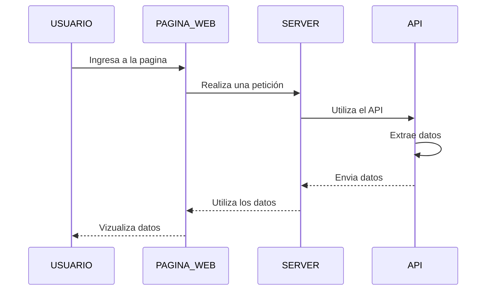
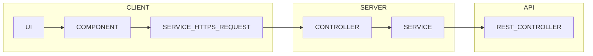

# POKEMON REST

## DOCUMENTACIÓN

> ## Creacion de proyectos para el Server y la Pagina Web
Se crean los proyectos con la herramienta de spring.io para el servidor y para el frontend con node_modules
>>Server

>>Pagina Web

##

## UML

##

## ARQUITECTURA DE SOFTWARE POR CAPAS

