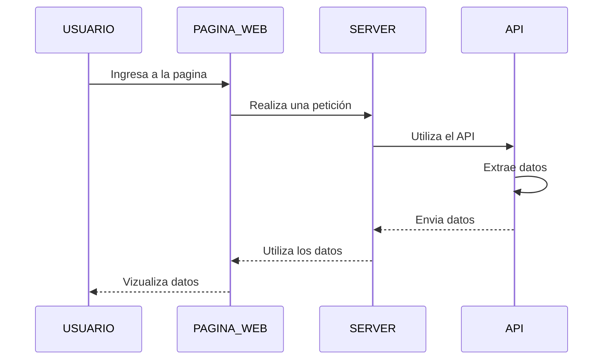
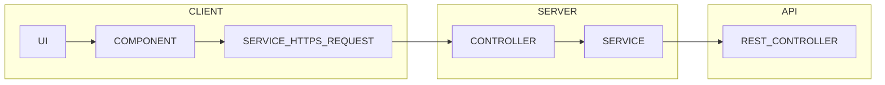

# POKEMON REST

## DOCUMENTACIÓN

> ## Definir mensajes de entrada y salida para usar el API
> - Ver el tipo de dato de salida del api 
>> 

> - Definir la entra y salida de los datos en el servicio del Servidor
>> 

##

> ## Usar Cliente REST en el API
> - Se usara a travez de la siguente URL **https://pokeapi.co/api/v2/pokemon?limit=100** de donde obtendremos a 100 pokemones
>> 
> - Se usara a travez de la siguente URL **https://pokeapi.co/api/v2/pokemon/1** donde el 1 indica el id del pokemon
>> 

##

> ## Se usara este servidor en una pagina web
> - Se configura el servidor
>> 
> - Se configura el servicio de la pagina web
>> 
> - se prueba que los datos se obtengan
> 

##

> ## Se crea la pagina web
> Funcionamiento de la pagina web haciendo uso del servidor que usa un API.
>> 

##

> ## Crear la imagen del Servidor de SpringBoot
> - Se crea el Dockerfile con los requerimientos del proyecto
>> 

> - Construir la imagen en Docker
>> 

> - Usar la Imagen en un Contenedor y usar el puerto 8090
>> 

> - Subir Imagen a DockerHub **https://hub.docker.com/repository/docker/ivan7uwu7/pokeapp-01**
>> 

> Poner **docker pull ivan7uwu7/pokeapp-01:0.0.1** en la terminal

##

## UML

##

## ARQUITECTURA DE SOFTWARE POR CAPAS

